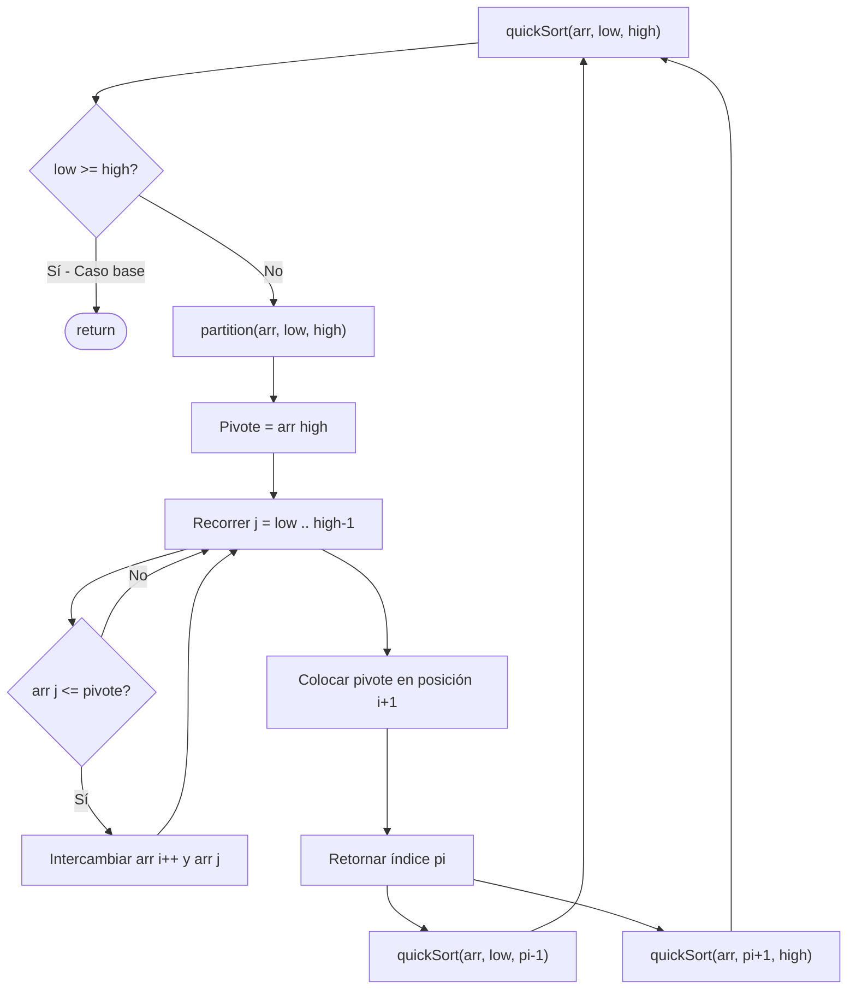
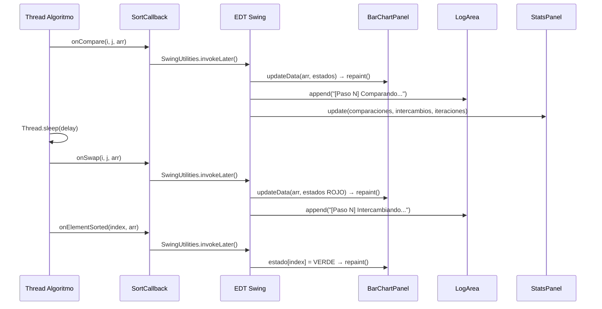

# Diagrama de Flujo — Visualizador de Algoritmos de Ordenamiento

## Flujo General del Sistema

```mermaid
flowchart TD
    A([🟢 Inicio]) --> B[Lanzar MainMenuFrame]
    B --> C{Usuario elige pestaña}

    C -->|Visualizador| D[Panel de Control]
    C -->|Reportes| R[Ver historial de sesión]
    C -->|Ayuda| H[Ver documentación]

    D --> E{¿Cómo ingresar datos?}
    E -->|Escribir manualmente| F[JTextArea + botón Cargar]
    E -->|Generar aleatorio| G[Math.random / java.util.Random]
    E -->|Archivo .txt| I[JFileChooser → leer líneas]

    F --> J[Parsear números a int[]]
    G --> J
    I --> J

    J --> K{¿Datos válidos?}
    K -->|No| L[Mostrar error]
    L --> D
    K -->|Sí| M[Mostrar arreglo en BarChartPanel]

    M --> N[Configurar algoritmo, orden y velocidad]
    N --> O[Presionar ▶ Iniciar]

    O --> P[Crear ExecutionStats - reiniciar contadores]
    P --> Q[Crear Thread separado con el algoritmo]
    Q --> S{¿Algoritmo seleccionado?}

    S -->|Bubble Sort| BS[BubbleSort.sort]
    S -->|Shell Sort| SS[ShellSort.sort]
    S -->|Quick Sort| QS[QuickSort.sort - RECURSIVO]

    BS --> CB[SortCallback.onCompare / onSwap / onIteration]
    SS --> CB
    QS --> CB

    CB --> TS[Thread.sleep - delay configurado]
    TS --> EDT[SwingUtilities.invokeLater]
    EDT --> UP[Actualizar BarChartPanel + StatsPanel + Log]
    UP --> FIN{¿Ordenamiento terminado?}

    FIN -->|No - continuar| CB
    FIN -->|Sí| DONE[Marcar todos los elementos en verde]

    DONE --> SAV[SessionHistory.addExecution]
    SAV --> REP[HtmlReportGenerator.generate → archivo .html]
    REP --> END([🔴 Ejecución completada])
```

---

## Flujo de Quick Sort Recursivo



---

## Flujo de Actualización de la UI


